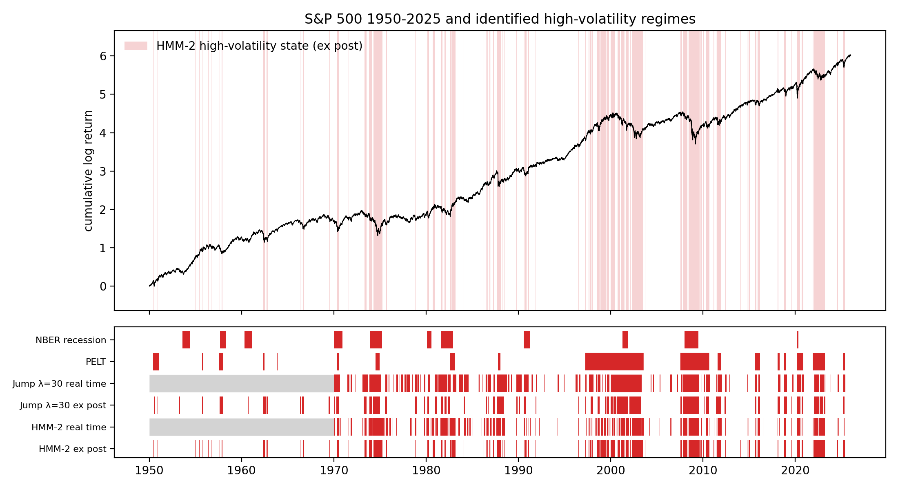
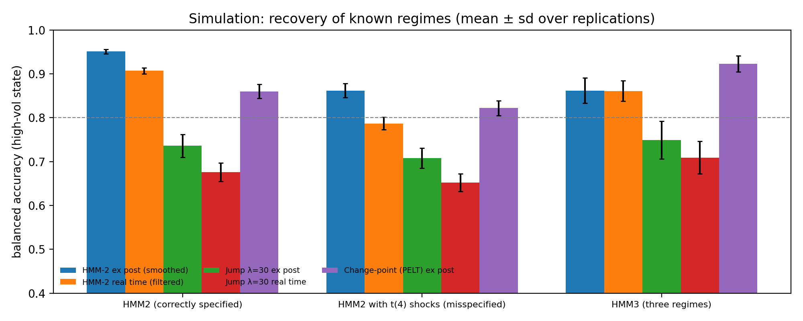
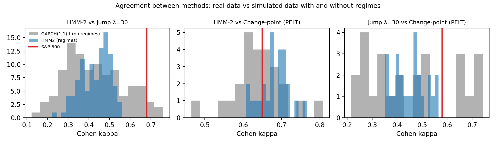

# Regime identification results

- Run finished: 2026-10-02T17:09:28 (runtime 27 min)
- Device: cuda (NVIDIA A100-SXM4-40GB, float32)
- Data: S&P 500 (^GSPC) daily log returns 1950-01-04 to 2025-12-31, n = 19120; VIX and NBER USREC for comparison. Downloaded 2026-10-02T16:05:24.
- Simulation: 100 replications per DGP, T = 19120; PELT on the first 25 replications
- Mode: full run

## 0. GPU implementation vs reference packages (hmmlearn, jumpmodels)

| check | torch | reference | passed |
|---|---|---|---|
| HMM K=2 log likelihood (hmmlearn) | -6941.090 | -6941.090 | True |
| HMM K=2 state sd | [0.6790000200271606, 2.0799999237060547] | [0.679, 2.08] | True |
| HMM K=2 smoothed-state kappa vs hmmlearn | 1.000 | > 0.95 | True |
| HMM K=2 filter max abs error vs numpy | 3.4e-05 | < 0.0001 | True |
| HMM K=2 predictive density max rel. error vs numpy | 1.2e-05 | < 0.0001 | True |
| HMM K=3 log likelihood (hmmlearn) | -6669.490 | -6669.450 | True |
| HMM K=3 state sd | [0.5199999809265137, 1.1959999799728394, 3.2179999351501465] | [0.516, 1.187, 3.178] | True |
| HMM K=3 smoothed-state kappa vs hmmlearn | 0.983 | > 0.95 | True |
| HMM K=3 filter max abs error vs numpy | 4.7e-05 | < 0.0001 | True |
| HMM K=3 predictive density max rel. error vs numpy | 6.2e-05 | < 0.0001 | True |
| Padded batching: short series in batch vs alone | -2441.656 | -2441.656 | True |
| Jump λ=10 objective (jumpmodels) | 9354.830 | 9354.830 | True |
| Jump λ=10 ex-post / online label kappa vs jumpmodels | 1.0000 / 1.0000 | > 0.95 | True |
| Jump λ=30 objective (jumpmodels) | 10228.080 | 10228.080 | True |
| Jump λ=30 ex-post / online label kappa vs jumpmodels | 1.0000 / 1.0000 | > 0.95 | True |
| Jump λ=100 objective (jumpmodels) | 11655.780 | 11655.780 | True |
| Jump λ=100 ex-post / online label kappa vs jumpmodels | 1.0000 / 1.0000 | > 0.95 | True |

## Scorecard

Criteria were fixed before the full run (after a 1990-2025 smoke test with 2 replications). They test (i) whether the detectors recover regimes that exist, (ii) whether the regime tests stay quiet when there are no regimes, (iii) whether the S&P 500 shows regimes beyond GARCH volatility clustering, (iv) whether real-time labels are usable, and (v) whether return autocorrelation differs by regime without look-ahead.

| group | criterion | value | threshold | result |
|---|---|---|---|---|
| 1 Detector accuracy (sim, true 2-regime data) | HMM-2 real time (filtered): balanced accuracy | 0.907 | >= 0.80 | PASS |
| 1 Detector accuracy (sim, true 2-regime data) | Jump λ=30 real time: balanced accuracy | 0.676 | >= 0.80 | FAIL |
| 1 Detector accuracy (sim, true 2-regime data) | HMM-2 ex post (smoothed): balanced accuracy | 0.951 | >= 0.80 | PASS |
| 1 Detector accuracy (sim, true 2-regime data) | Jump λ=30 ex post: balanced accuracy | 0.736 | >= 0.80 | FAIL |
| 2 No false regimes | BIC on raw returns finds K>=2 in GARCH-t data (no regimes) | 1.000 | <= 0.05 | FAIL |
| 2 No false regimes | BIC on GARCH-t residuals finds K>=2 in GARCH-t data (size) | 0.000 | <= 0.10 | PASS |
| 2 No false regimes | BIC on GARCH-t residuals finds K>=2 in true 2-regime data (power) | 0.010 | >= 0.80 | FAIL |
| 3 Regimes in the S&P 500 | BIC on GARCH-t residuals of the S&P 500 selects K>=2 | K = 4 | K >= 2 (valid only if size and power pass) | PASS |
| 3 Regimes in the S&P 500 | Best HMM (Gaussian HMM, K=4) beats GARCH-t out of sample (DM t) | -4.290 | >= 1.96 | FAIL |
| 3 Regimes in the S&P 500 | Agreement HMM-2 vs Jump λ=30: real kappa vs no-regime (GARCH-t) 95th pct | 0.68 vs 0.67 | real > null p95 | PASS |
| 3 Regimes in the S&P 500 | Agreement HMM-2 vs Change-point (PELT): real kappa vs no-regime (GARCH-t) 95th pct | 0.65 vs 0.74 | real > null p95 | FAIL |
| 3 Regimes in the S&P 500 | Agreement Jump λ=30 vs Change-point (PELT): real kappa vs no-regime (GARCH-t) 95th pct | 0.58 vs 0.73 | real > null p95 | FAIL |
| 4 Real-time usability | HMM-2 real time vs ex post: kappa (1970-2025) | 0.649 | >= 0.70 | FAIL |
| 4 Real-time usability | Jump λ=30 real time vs ex post: kappa (1970-2025) | 0.576 | >= 0.70 | FAIL |
| 5 Efficiency differs by regime | HMM-2 real time: test false-positive rate in GARCH-t data | 0.090 | <= 0.10 | PASS |
| 5 Efficiency differs by regime | HMM-2 real time: AR(1) high minus low (all (1970-2025)), White t | -0.086 (t = -3.12) | |t| >= 1.96 (valid only if false-positive rate passes) | PASS |
| 5 Efficiency differs by regime | Jump λ=30 real time: test false-positive rate in GARCH-t data | 0.060 | <= 0.10 | PASS |
| 5 Efficiency differs by regime | Jump λ=30 real time: AR(1) high minus low (all (1970-2025)), White t | -0.063 (t = -2.12) | |t| >= 1.96 (valid only if false-positive rate passes) | PASS |

## A. Simulation

### A1. Accuracy of each method when the true regimes are known

Balanced accuracy and kappa for the high-volatility state; delay = median trading days from a true switch into the high state until detection; switch_ratio = detected / true number of switches.

| dgp | method | n_reps | balanced_accuracy | ba_sd | kappa | median_delay_days | missed_episodes | switch_ratio |
|---|---|---|---|---|---|---|---|---|
| HMM2 (correctly specified) | Change-point (PELT) ex post | 25 | 0.860 | 0.016 | 0.665 | 0.000 | 0.365 | 0.291 |
| HMM2 (correctly specified) | HMM-2 ex post (smoothed) | 100 | 0.951 | 0.005 | 0.913 | 0.000 | 0.122 | 0.836 |
| HMM2 (correctly specified) | HMM-2 real time (filtered) | 100 | 0.907 | 0.007 | 0.826 | 1.000 | 0.090 | 1.856 |
| HMM2 (correctly specified) | Jump λ=10 ex post | 100 | 0.723 | 0.032 | 0.385 | 1.000 | 0.232 | 0.890 |
| HMM2 (correctly specified) | Jump λ=10 real time | 100 | 0.695 | 0.028 | 0.330 | 2.000 | 0.221 | 1.266 |
| HMM2 (correctly specified) | Jump λ=100 ex post | 100 | 0.715 | 0.023 | 0.411 | 0.000 | 0.489 | 0.258 |
| HMM2 (correctly specified) | Jump λ=100 real time | 100 | 0.619 | 0.019 | 0.215 | 4.500 | 0.470 | 0.421 |
| HMM2 (correctly specified) | Jump λ=30 ex post | 100 | 0.736 | 0.026 | 0.425 | 1.000 | 0.323 | 0.518 |
| HMM2 (correctly specified) | Jump λ=30 real time | 100 | 0.676 | 0.021 | 0.307 | 4.000 | 0.317 | 0.752 |
| HMM2 with t(4) shocks (misspecified) | Change-point (PELT) ex post | 25 | 0.822 | 0.017 | 0.609 | 0.000 | 0.408 | 0.299 |
| HMM2 with t(4) shocks (misspecified) | HMM-2 ex post (smoothed) | 100 | 0.862 | 0.016 | 0.751 | 0.000 | 0.099 | 2.691 |
| HMM2 with t(4) shocks (misspecified) | HMM-2 real time (filtered) | 100 | 0.787 | 0.014 | 0.611 | 1.000 | 0.081 | 5.727 |
| HMM2 with t(4) shocks (misspecified) | Jump λ=10 ex post | 100 | 0.696 | 0.029 | 0.325 | 0.000 | 0.235 | 0.955 |
| HMM2 with t(4) shocks (misspecified) | Jump λ=10 real time | 100 | 0.668 | 0.025 | 0.271 | 1.500 | 0.224 | 1.328 |
| HMM2 with t(4) shocks (misspecified) | Jump λ=100 ex post | 100 | 0.692 | 0.024 | 0.363 | 0.000 | 0.504 | 0.252 |
| HMM2 with t(4) shocks (misspecified) | Jump λ=100 real time | 100 | 0.607 | 0.020 | 0.191 | 0.000 | 0.479 | 0.426 |
| HMM2 with t(4) shocks (misspecified) | Jump λ=30 ex post | 100 | 0.708 | 0.023 | 0.362 | 0.000 | 0.327 | 0.550 |
| HMM2 with t(4) shocks (misspecified) | Jump λ=30 real time | 100 | 0.652 | 0.020 | 0.255 | 3.000 | 0.317 | 0.811 |
| HMM3 (three regimes) | Change-point (PELT) ex post | 25 | 0.923 | 0.018 | 0.660 | 0.000 | 0.298 | 0.548 |
| HMM3 (three regimes) | HMM-2 ex post (smoothed) | 100 | 0.862 | 0.029 | 0.250 | 0.000 | 0.021 | 5.096 |
| HMM3 (three regimes) | HMM-2 real time (filtered) | 100 | 0.861 | 0.023 | 0.264 | 0.000 | 0.024 | 14.467 |
| HMM3 (three regimes) | HMM-3 ex post, 3-class | 100 | 0.912 | 0.010 | 0.857 |  |  | 0.783 |
| HMM3 (three regimes) | Jump λ=10 ex post | 100 | 0.728 | 0.041 | 0.129 | 0.000 | 0.121 | 3.097 |
| HMM3 (three regimes) | Jump λ=10 real time | 100 | 0.710 | 0.038 | 0.114 | 0.000 | 0.119 | 4.439 |
| HMM3 (three regimes) | Jump λ=100 ex post | 100 | 0.772 | 0.043 | 0.232 | 0.000 | 0.279 | 0.753 |
| HMM3 (three regimes) | Jump λ=100 real time | 100 | 0.681 | 0.038 | 0.139 | 0.000 | 0.337 | 1.284 |
| HMM3 (three regimes) | Jump λ=30 ex post | 100 | 0.749 | 0.043 | 0.153 | 0.000 | 0.155 | 1.748 |
| HMM3 (three regimes) | Jump λ=30 real time | 100 | 0.709 | 0.037 | 0.121 | 0.000 | 0.176 | 2.669 |

### A2. How often BIC finds regimes

Raw returns:

| dgp | K=1 | K=2 | K=3 | K=4 |
|---|---|---|---|---|
| GARCH(1,1)-t (no regimes) | 0 | 0 | 0 | 100 |
| HMM2 (correctly specified) | 0 | 100 | 0 | 0 |
| HMM2 with t(4) shocks (misspecified) | 0 | 0 | 0 | 100 |
| HMM3 (three regimes) | 0 | 0 | 100 | 0 |

GARCH(1,1)-t PIT residuals (regimes beyond volatility clustering):

| dgp | K=1 | K=2 | K=3 | K=4 |
|---|---|---|---|---|
| GARCH(1,1)-t (no regimes) | 100 | 0 | 0 | 0 |
| HMM2 (correctly specified) | 99 | 1 | 0 | 0 |
| HMM2 with t(4) shocks (misspecified) | 80 | 19 | 1 | 0 |
| HMM3 (three regimes) | 99 | 1 | 0 | 0 |

| dgp | share_K>=2_raw_returns | share_K>=2_garch_residuals |
|---|---|---|
| GARCH(1,1)-t (no regimes) | 1.000 | 0.000 |
| HMM2 (correctly specified) | 1.000 | 0.010 |
| HMM2 with t(4) shocks (misspecified) | 1.000 | 0.200 |
| HMM3 (three regimes) | 1.000 | 0.010 |

### A3. Agreement between methods in simulated data (null distribution for Part B)

| dgp | pair | n_reps | mean | p05 | p95 |
|---|---|---|---|---|---|
| GARCH(1,1)-t (no regimes) | HMM-2 vs Change-point (PELT) | 25 | 0.640 | 0.555 | 0.741 |
| GARCH(1,1)-t (no regimes) | HMM-2 vs Jump λ=10 | 100 | 0.333 | 0.141 | 0.603 |
| GARCH(1,1)-t (no regimes) | HMM-2 vs Jump λ=100 | 100 | 0.539 | 0.399 | 0.660 |
| GARCH(1,1)-t (no regimes) | HMM-2 vs Jump λ=30 | 100 | 0.426 | 0.234 | 0.665 |
| GARCH(1,1)-t (no regimes) | Jump λ=10 vs Change-point (PELT) | 25 | 0.361 | 0.159 | 0.593 |
| GARCH(1,1)-t (no regimes) | Jump λ=10 vs Jump λ=100 | 100 | 0.536 | 0.328 | 0.748 |
| GARCH(1,1)-t (no regimes) | Jump λ=10 vs Jump λ=30 | 100 | 0.797 | 0.641 | 0.892 |
| GARCH(1,1)-t (no regimes) | Jump λ=100 vs Change-point (PELT) | 25 | 0.574 | 0.422 | 0.784 |
| GARCH(1,1)-t (no regimes) | Jump λ=30 vs Change-point (PELT) | 25 | 0.455 | 0.250 | 0.733 |
| GARCH(1,1)-t (no regimes) | Jump λ=30 vs Jump λ=100 | 100 | 0.683 | 0.422 | 0.863 |
| HMM2 (correctly specified) | HMM-2 vs Change-point (PELT) | 25 | 0.681 | 0.611 | 0.732 |
| HMM2 (correctly specified) | HMM-2 vs Jump λ=10 | 100 | 0.390 | 0.261 | 0.512 |
| HMM2 (correctly specified) | HMM-2 vs Jump λ=100 | 100 | 0.420 | 0.318 | 0.498 |
| HMM2 (correctly specified) | HMM-2 vs Jump λ=30 | 100 | 0.432 | 0.312 | 0.527 |
| HMM2 (correctly specified) | Jump λ=10 vs Change-point (PELT) | 25 | 0.400 | 0.292 | 0.527 |
| HMM2 (correctly specified) | Jump λ=10 vs Jump λ=100 | 100 | 0.679 | 0.543 | 0.773 |
| HMM2 (correctly specified) | Jump λ=10 vs Jump λ=30 | 100 | 0.864 | 0.757 | 0.921 |
| HMM2 (correctly specified) | Jump λ=100 vs Change-point (PELT) | 25 | 0.479 | 0.359 | 0.599 |
| HMM2 (correctly specified) | Jump λ=30 vs Change-point (PELT) | 25 | 0.453 | 0.358 | 0.559 |
| HMM2 (correctly specified) | Jump λ=30 vs Jump λ=100 | 100 | 0.774 | 0.676 | 0.845 |
| HMM2 with t(4) shocks (misspecified) | HMM-2 vs Change-point (PELT) | 25 | 0.540 | 0.466 | 0.603 |
| HMM2 with t(4) shocks (misspecified) | HMM-2 vs Jump λ=10 | 100 | 0.285 | 0.186 | 0.390 |
| HMM2 with t(4) shocks (misspecified) | HMM-2 vs Jump λ=100 | 100 | 0.313 | 0.233 | 0.378 |
| HMM2 with t(4) shocks (misspecified) | HMM-2 vs Jump λ=30 | 100 | 0.315 | 0.221 | 0.392 |
| HMM2 with t(4) shocks (misspecified) | Jump λ=10 vs Change-point (PELT) | 25 | 0.350 | 0.235 | 0.459 |
| HMM2 with t(4) shocks (misspecified) | Jump λ=10 vs Jump λ=100 | 100 | 0.637 | 0.495 | 0.732 |
| HMM2 with t(4) shocks (misspecified) | Jump λ=10 vs Jump λ=30 | 100 | 0.856 | 0.763 | 0.908 |
| HMM2 with t(4) shocks (misspecified) | Jump λ=100 vs Change-point (PELT) | 25 | 0.429 | 0.327 | 0.517 |
| HMM2 with t(4) shocks (misspecified) | Jump λ=30 vs Change-point (PELT) | 25 | 0.398 | 0.329 | 0.498 |
| HMM2 with t(4) shocks (misspecified) | Jump λ=30 vs Jump λ=100 | 100 | 0.743 | 0.599 | 0.843 |
| HMM3 (three regimes) | HMM-2 vs Change-point (PELT) | 25 | 0.338 | 0.229 | 0.461 |
| HMM3 (three regimes) | HMM-2 vs Jump λ=10 | 100 | 0.371 | 0.262 | 0.460 |
| HMM3 (three regimes) | HMM-2 vs Jump λ=100 | 100 | 0.343 | 0.253 | 0.429 |
| HMM3 (three regimes) | HMM-2 vs Jump λ=30 | 100 | 0.383 | 0.303 | 0.449 |
| HMM3 (three regimes) | Jump λ=10 vs Change-point (PELT) | 25 | 0.181 | 0.090 | 0.305 |
| HMM3 (three regimes) | Jump λ=10 vs Jump λ=100 | 100 | 0.608 | 0.396 | 0.721 |
| HMM3 (three regimes) | Jump λ=10 vs Jump λ=30 | 100 | 0.868 | 0.796 | 0.910 |
| HMM3 (three regimes) | Jump λ=100 vs Change-point (PELT) | 25 | 0.303 | 0.128 | 0.543 |
| HMM3 (three regimes) | Jump λ=30 vs Change-point (PELT) | 25 | 0.209 | 0.099 | 0.342 |
| HMM3 (three regimes) | Jump λ=30 vs Jump λ=100 | 100 | 0.694 | 0.454 | 0.828 |

### A4. Regime-dependent AR(1) test: false-positive rate (no DGP has return predictability)

| dgp | labels | n_reps | rejection_rate_5pct | mean_t |
|---|---|---|---|---|
| GARCH(1,1)-t (no regimes) | HMM-2 real time | 100 | 0.090 | -0.148 |
| GARCH(1,1)-t (no regimes) | Jump λ=30 real time | 100 | 0.060 | -0.170 |
| HMM2 (correctly specified) | HMM-2 real time | 100 | 0.040 | 0.137 |
| HMM2 (correctly specified) | Jump λ=30 real time | 100 | 0.040 | 0.070 |
| HMM2 with t(4) shocks (misspecified) | HMM-2 real time | 100 | 0.060 | -0.001 |
| HMM2 with t(4) shocks (misspecified) | Jump λ=30 real time | 100 | 0.070 | 0.184 |
| HMM3 (three regimes) | HMM-2 real time | 100 | 0.060 | 0.030 |
| HMM3 (three regimes) | Jump λ=30 real time | 100 | 0.050 | 0.035 |

## B. S&P 500, 1950-2025

### B1. Model comparison (BIC full sample; out-of-sample mean log score 2000-2025, parameters estimated before the out-of-sample period; DM t > 0 favours the row over GARCH-t)

| model | n_params | bic_full_sample | oos_mean_log_score | oos_diff_vs_garch_t | dm_t_vs_garch_t |
|---|---|---|---|---|---|
| Gaussian i.i.d. (K=1) | 2 | 54156.228 | -1.780 | -0.422 | -5.493 |
| Gaussian HMM, K=2 | 7 | 47484.344 | -1.445 | -0.088 | -3.711 |
| Gaussian HMM, K=3 | 14 | 46209.008 | -1.388 | -0.030 | -4.352 |
| Gaussian HMM, K=4 | 23 | 45800.304 | -1.373 | -0.015 | -4.290 |
| GARCH(1,1)-normal (no regimes) | 4 | 46520.282 | -1.383 | -0.026 | -4.771 |
| GARCH(1,1)-t (no regimes) | 5 | 45403.500 | -1.358 | 0.000 |  |

### B2. HMM parameters

| K | state | ann_mean_return_pct | ann_vol_pct | expected_duration_days | share_of_days_pct |
|---|---|---|---|---|---|
| 2 | 0 | 16.300 | 10.100 | 81.700 | 77.320 |
| 2 | 1 | -19.260 | 27.010 | 25.140 | 22.680 |
| 3 | 0 | 19.200 | 8.310 | 46.480 | 52.130 |
| 3 | 1 | 1.430 | 16.290 | 31.650 | 42.760 |
| 3 | 2 | -44.590 | 42.000 | 20.170 | 5.120 |

### B3. Agreement between methods (Cohen kappa, ex post)

| index | HMM-2 | HMM-3 top state | Jump λ=10 | Jump λ=30 | Jump λ=100 | Change-point (PELT) | Bear market (20% rule) | NBER recession | VIX ≥ 20 (1990+) |
|---|---|---|---|---|---|---|---|---|---|
| HMM-2 | 1.000 | 0.310 | 0.610 | 0.680 | 0.670 | 0.650 | 0.250 | 0.230 | 0.710 |
| HMM-3 top state | 0.310 | 1.000 | 0.240 | 0.300 | 0.320 | 0.320 | 0.150 | 0.170 | 0.260 |
| Jump λ=10 | 0.610 | 0.240 | 1.000 | 0.810 | 0.630 | 0.460 | 0.340 | 0.200 | 0.600 |
| Jump λ=30 | 0.680 | 0.300 | 0.810 | 1.000 | 0.790 | 0.580 | 0.400 | 0.270 | 0.640 |
| Jump λ=100 | 0.670 | 0.320 | 0.630 | 0.790 | 1.000 | 0.720 | 0.360 | 0.280 | 0.700 |
| Change-point (PELT) | 0.650 | 0.320 | 0.460 | 0.580 | 0.720 | 1.000 | 0.220 | 0.150 | 0.720 |
| Bear market (20% rule) | 0.250 | 0.150 | 0.340 | 0.400 | 0.360 | 0.220 | 1.000 | 0.280 | 0.270 |
| NBER recession | 0.230 | 0.170 | 0.200 | 0.270 | 0.280 | 0.150 | 0.280 | 1.000 | 0.230 |
| VIX ≥ 20 (1990+) | 0.710 | 0.260 | 0.600 | 0.640 | 0.700 | 0.720 | 0.270 | 0.230 | 1.000 |

| index | share_high_pct | n_switches | mean_spell_days |
|---|---|---|---|
| HMM-2 | 22.700 | 296.000 | 64.400 |
| HMM-3 top state | 5.100 | 82.000 | 230.400 |
| Jump λ=10 | 26.700 | 270.000 | 70.600 |
| Jump λ=30 | 22.000 | 122.000 | 155.400 |
| Jump λ=100 | 21.400 | 46.000 | 406.800 |
| Change-point (PELT) | 21.400 | 36.000 | 516.800 |
| Bear market (20% rule) | 15.500 | 26.000 | 708.100 |
| NBER recession | 12.400 | 22.000 | 831.300 |
| VIX ≥ 20 (1990+) | 37.400 | 492.000 | 18.400 |

### B4. Real-time (expanding window, refit yearly) vs ex-post labels

| real_time_method | ex_post_reference | period | agreement_pct | kappa | real_time_switches_per_year | ex_post_switches_per_year |
|---|---|---|---|---|---|---|
| HMM-2 real time | HMM-2 | 1970-2025 | 84.180 | 0.649 | 21.504 | 4.176 |
| Jump λ=30 real time | Jump λ=30 | 1970-2025 | 79.987 | 0.576 | 3.694 | 1.785 |

| method | episode | date | ex_post_lag_days | real_time_lag_days |
|---|---|---|---|---|
| HMM-2 | 1987 crash | 1987-10-14 | 0 | 0 |
| HMM-2 | 2008 Lehman | 2008-09-15 | 0 | 0 |
| HMM-2 | 2011 US downgrade | 2011-08-01 | 0 | 1 |
| HMM-2 | 2020 Covid | 2020-02-21 | 0 | 1 |
| HMM-2 | 2022 rate shock | 2022-01-18 | 0 | 0 |
| Jump λ=30 | 1987 crash | 1987-10-14 | 0 | 0 |
| Jump λ=30 | 2008 Lehman | 2008-09-15 | 0 | 0 |
| Jump λ=30 | 2011 US downgrade | 2011-08-01 | 0 | 0 |
| Jump λ=30 | 2020 Covid | 2020-02-21 | 1 | 3 |
| Jump λ=30 | 2022 rate shock | 2022-01-18 | 0 | 4 |

### B5. Parameter stability

| sample | low_vol_ann_pct | high_vol_ann_pct | low_dur_days | high_dur_days |
|---|---|---|---|---|
| 1950-1987 | 9.330 | 23.030 | 72.310 | 18.950 |
| 1988-2025 | 10.960 | 29.310 | 82.250 | 30.280 |
| full 1950-2025 | 10.100 | 27.010 | 81.700 | 25.140 |

Kappa between full-sample labels and second-half labels filtered with first-half parameters: 0.752

### B6. Regimes beyond GARCH: BIC on GARCH(1,1)-t PIT residuals

| K | bic_garch_t_pit_residuals |
|---|---|
| 1 | 54254.500 |
| 2 | 54089.880 |
| 3 | 53878.130 |
| 4 | 53870.860 |

Selected K: raw returns 4, GARCH-t residuals 4.

## C. Efficiency by regime

### C1. AR(1) in low- vs high-volatility states (label at t-1; White t statistics)

| labels | type | period | ar1_low | t_low | ar1_high | t_high | diff | t_diff | n | share_high |
|---|---|---|---|---|---|---|---|---|---|---|
| HMM-2 real time | real time | all (1970-2025) | 0.052 | 3.668 | -0.034 | -1.435 | -0.086 | -3.117 | 14120 | 0.386 |
| HMM-2 real time | real time | 1950-1979 | 0.285 | 8.961 | 0.241 | 8.182 | -0.044 | -1.017 | 2525 | 0.413 |
| HMM-2 real time | real time | 1980-1999 | 0.086 | 3.527 | 0.026 | 0.496 | -0.060 | -1.047 | 5055 | 0.383 |
| HMM-2 real time | real time | 2000-2025 | -0.029 | -1.423 | -0.113 | -3.754 | -0.084 | -2.331 | 6538 | 0.378 |
| Jump λ=30 real time | real time | all (1970-2025) | 0.028 | 1.942 | -0.035 | -1.352 | -0.063 | -2.116 | 14120 | 0.439 |
| Jump λ=30 real time | real time | 1950-1979 | 0.240 | 8.043 | 0.254 | 7.886 | 0.013 | 0.305 | 2525 | 0.496 |
| Jump λ=30 real time | real time | 1980-1999 | 0.017 | 0.760 | 0.049 | 0.768 | 0.032 | 0.471 | 5055 | 0.452 |
| Jump λ=30 real time | real time | 2000-2025 | -0.018 | -0.835 | -0.123 | -3.824 | -0.105 | -2.707 | 6538 | 0.407 |
| HMM-2 | ex post (look-ahead) | all (1950-2025) | 0.082 | 9.574 | -0.044 | -1.778 | -0.127 | -4.807 | 19119 | 0.227 |
| HMM-2 | ex post (look-ahead) | 1950-1979 | 0.191 | 14.185 | 0.152 | 3.787 | -0.039 | -0.913 | 7524 | 0.114 |
| HMM-2 | ex post (look-ahead) | 1980-1999 | 0.049 | 3.166 | 0.029 | 0.448 | -0.020 | -0.295 | 5055 | 0.221 |
| HMM-2 | ex post (look-ahead) | 2000-2025 | -0.029 | -1.851 | -0.119 | -3.877 | -0.090 | -2.600 | 6538 | 0.362 |
| Jump λ=30 | ex post (look-ahead) | all (1950-2025) | 0.064 | 6.429 | -0.052 | -1.889 | -0.116 | -3.952 | 19119 | 0.220 |
| Jump λ=30 | ex post (look-ahead) | 1950-1979 | 0.162 | 9.539 | 0.185 | 4.332 | 0.023 | 0.493 | 7524 | 0.133 |
| Jump λ=30 | ex post (look-ahead) | 1980-1999 | 0.044 | 2.595 | 0.019 | 0.234 | -0.025 | -0.297 | 5055 | 0.193 |
| Jump λ=30 | ex post (look-ahead) | 2000-2025 | -0.024 | -1.360 | -0.128 | -3.898 | -0.103 | -2.774 | 6538 | 0.340 |
| Bear market (20% rule) | ex post (look-ahead) | all (1950-2025) | 0.014 | 1.092 | -0.056 | -1.229 | -0.070 | -1.479 | 19119 | 0.155 |
| Bear market (20% rule) | ex post (look-ahead) | 1950-1979 | 0.153 | 7.778 | 0.210 | 4.371 | 0.057 | 1.103 | 7524 | 0.188 |
| Bear market (20% rule) | ex post (look-ahead) | 1980-1999 | 0.029 | 1.376 | 0.051 | 0.315 | 0.022 | 0.133 | 5055 | 0.099 |
| Bear market (20% rule) | ex post (look-ahead) | 2000-2025 | -0.065 | -3.054 | -0.177 | -3.268 | -0.112 | -1.921 | 6538 | 0.161 |

### C2. Rolling one-year variance-ratio tests

| series | pct_windows_rejecting | sim_p95 |
|---|---|---|
| Real S&P 500, 1950-2025 | 28.700 |  |
| Real S&P 500, 1950-1979 | 53.900 |  |
| Real S&P 500, 1980-1999 | 6.100 |  |
| Real S&P 500, 2000-2025 | 18.300 |  |
| Simulated HMM-2 (regimes, no predictability), mean of 20 | 4.700 | 7.100 |
| Simulated HMM-3 (regimes, no predictability), mean of 20 | 4.700 | 7.600 |
| Simulated GARCH(1,1)-t (no regimes, no predictability), mean of 20 | 5.300 | 7.400 |
| Nominal size of the test | 5.000 |  |

## Figures

## Methods (for the paper)

- Returns: 100 x daily log change of the S&P 500 index close.
- Gaussian HMM (Hamilton 1989): K = 2-4 states, Baum-Welch EM with 3-5 random restarts, states ordered by volatility; ex-post labels = smoothed probability > 0.5; real-time labels = filtered probability > 0.5 with parameters re-estimated each January on all data up to the previous December (from 1970).
- Statistical jump model (Nystrup et al. 2020; Shu, Yu & Mulvey 2024): 2 states, features = EWMA mean return, log downside deviation and Sortino ratio at half-lives 5/10/21 days, standardized on the estimation window; jump penalty λ in [10.0, 30.0, 100.0]; online labels from the forward dynamic program.
- Change points: PELT (Killick et al. 2012), Gaussian mean/variance cost, penalty 3 log T, minimum segment 21 days; segments clustered into 2 volatility groups with k-means on log segment volatility.
- Bear markets: 20% peak-to-trough / trough-to-peak rule (Lunde & Timmermann 2004).
- Number of regimes: BIC = -2 log L + p log T with p = (K-1) + K(K-1) + 2K.
- Regimes beyond GARCH: GARCH(1,1)-t standardized residuals mapped to N(0,1) through the fitted t CDF, then the same BIC comparison.
- Out-of-sample: parameters estimated on data before 2000-01-01; one-step predictive log densities; Diebold-Mariano with Newey-West (10 lags) standard errors.
- Simulation DGPs use parameters estimated on the real series: HMM-2, HMM-2 with standardized t(4) shocks, HMM-3 (truth = top state), GARCH(1,1)-t (no regimes).
- AR(1) by regime: r_t on r_{t-1}, the label at t-1 and their product; White (HC0) standard errors.
- Variance ratio: Lo-MacKinlay heteroskedasticity-robust VR(2) z test on 252-day windows every 21 days.
- Agreement: Cohen kappa between binary high-volatility labels.

Data: Yahoo Finance (^GSPC, ^VIX) and FRED (USREC). Yahoo Finance data may not be redistributed; cite the download date above.
